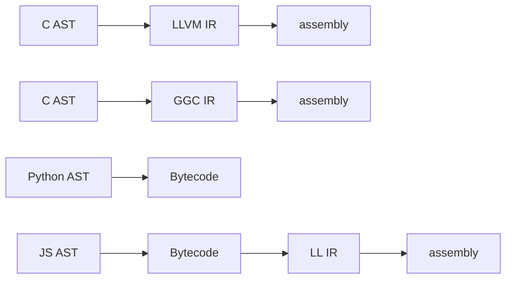
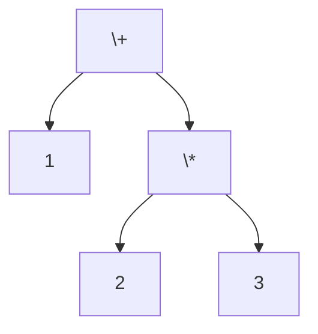

<!-- LTeX: language=pt-br -->
# Compiladores, na Prática

## Geração de código

Converter uma representação intermediaria em um formato de execução linear.

Não necessariamente assembly, mas algum formato "linear".

> Mesmo linguagens interpretadas costumam realizar um passo de _codegen_.
<!-- .element: class="fragment" -->

## Exemplos

Mesmo linguagens interpretadas costumam realizar um passo de _codegen_.



## Geração Direta de Código

Gerar o código diretamente a partir da AST.

Muito ineficiente, mas simples.
<!-- .element: class="fragment" -->

## _Tree-Walking_

Considerando a seguinte expressão.

```python
1 + 2 * 3 # 7
```



## _Tree-Walking_

Pode ser representada como uma _stack-machine_.

```python
[ 1 ]           # 1
[ 1 ][ 2 ]      # 2
[ 1 ][ 2 ][ 3 ] # 3
[ 1 ][ 6 ]      # 2 * 3
[ 7 ]           # 1 + 6
```


